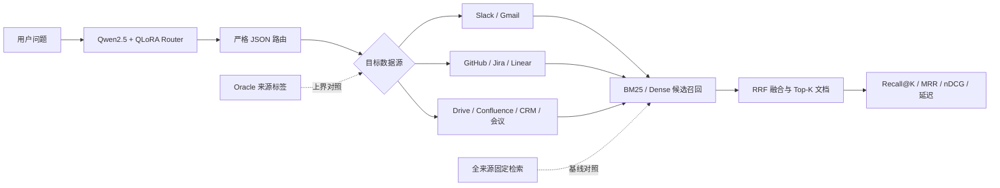

# RouteRAG：基于 LoRA 查询路由的企业知识检索实验

[](https://github.com/zhuzhenxiang93-create/RAG/actions/workflows/ci.yml)

本项目研究一个明确问题：

> 企业知识分散在邮件、聊天、研发任务、会议纪要等不同来源中。相比对所有问题使用固定检索范围，LoRA 能否学习“问题类型 + 数据来源 + 检索深度”，进而改善相关文档召回并减少无效检索？

主数据集为 [EnterpriseRAG-Bench](https://github.com/onyx-dot-app/EnterpriseRAG-Bench)。
它模拟 Redwood Inference 公司的多源内部知识库，包含约 50 万份文档和 500 道评测问题。

项目重点是 LoRA 微调、严格数据划分和对照实验。原有文档上传页面、法律分类插件和
MASSIVE 意图分类代码保留为历史工程能力，但不再作为项目主线。

## 方法

```text
问题
  → Qwen + LoRA 结构化查询路由
  → 预测问题类型、目标数据源、跨文档需求和检索深度
  → BM25 / Dense / RRF
  → 相关文档
  → Recall@K、MRR、nDCG 与延迟评测
```

LoRA 输出示例：

```json
{
  "question_type": "project_related",
  "sources": ["linear", "slack", "gmail"],
  "multi_document": true,
  "conflict_check": false,
  "completeness_required": true,
  "retrieval_depth": "deep",
  "answerability": "answerable"
}
```

LoRA 不负责记住企业事实，也不直接生成最终答案。企业知识保留在检索库中，LoRA
只学习相对稳定的查询理解和检索策略。



## 数据隔离

官方 Redwood `questions.jsonl` 只能用于最终评测，不能拆分后训练。

```text
独立生成的训练公司 questions.jsonl
  └── LoRA train / validation

官方 Redwood questions.jsonl
  └── benchmark only
```

`prepare_enterprise_router.py` 会检查：

- 训练文件和评测文件是否为同一路径；
- `question_id` 是否重复；
- 规范化问题文本的 SHA-256 是否重复。

样例文件 `data/samples/enterprise_router_train.sample.jsonl` 仅用于测试训练链路，
不能用于报告模型效果。

## 1. 安装

Lite 工程测试：

```powershell
python -m pip install -r requirements-lite.txt
```

LoRA 和真实向量模型：

```powershell
python -m pip install -r requirements-full.txt
```

QLoRA 的 4-bit 模式还需要受支持的 CUDA 与 bitsandbytes 环境。

## 2. 下载官方评测问题

```powershell
python scripts\download_enterprise_rag_bench.py `
  --output data\enterprise_rag_bench
```

文档体积较大，建议从官方 Release 或 Hugging Face 先下载某个来源的切片，再逐步扩大。
解压后统一放置为：

```text
data/enterprise_rag_bench/corpus/
├── slack/*.txt
├── gmail/*.txt
├── github/*.txt
├── jira/*.txt
└── ...
```

## 3. 准备 LoRA 数据

仓库提供不读取官方测试题的 Northstar Labs 独立训练集生成器。正式 V2 使用
`production-shaped` 流量先验生成 2,000 条；`balanced` 可用于类别均衡消融：

```powershell
python scripts\generate_router_training_questions.py `
  --output data\enterprise_router\northstar_questions.jsonl `
  --profile production-shaped `
  --seed 20260727
```

然后划分训练/验证集并将官方题只登记为 benchmark：

```powershell
python scripts\prepare_enterprise_router.py `
  --train-questions data\enterprise_router\northstar_questions.jsonl `
  --benchmark-questions data\enterprise_rag_bench\benchmark\questions.jsonl `
  --output data\enterprise_router `
  --validation-ratio 0.15 `
  --seed 42
```

额外的模糊污染检查：

```powershell
python scripts\check_router_leakage.py `
  --train data\enterprise_router\northstar_questions.jsonl `
  --benchmark data\enterprise_rag_bench\benchmark\questions.jsonl `
  --max-token-jaccard 0.8
```

V2 固定数据产物为训练 1,700 条、验证 300 条、官方测试 500 条；精确重合为 0，
最大两两词集合 Jaccard 为 0.233333。该数值只用于污染审计，不是模型效果。

## 4. 训练 LoRA

```powershell
python scripts\train_enterprise_router_lora.py `
  --data-dir data\enterprise_router `
  --base-model Qwen/Qwen2.5-1.5B-Instruct `
  --output artifacts\enterprise-router-lora `
  --rank 16 `
  --alpha 32 `
  --epochs 3 `
  --learning-rate 2e-4 `
  --batch-size 2 `
  --gradient-accumulation-steps 8 `
  --bf16 `
  --load-in-4bit
```

首次只验证显存、依赖和数据链路：

```powershell
python scripts\train_enterprise_router_lora.py `
  --data-dir data\enterprise_router `
  --output artifacts\enterprise-router-smoke `
  --smoke-max-steps 2
```

Smoke 结果不能作为正式实验指标。

## 5. 路由器对照实验

基础模型零样本：

```powershell
python scripts\evaluate_enterprise_router.py `
  --data data\enterprise_router\benchmark.jsonl `
  --base-model Qwen/Qwen2.5-1.5B-Instruct `
  --load-in-4bit `
  --offline `
  --output artifacts\base-router.json
```

LoRA：

```powershell
python scripts\evaluate_enterprise_router.py `
  --data data\enterprise_router\benchmark.jsonl `
  --base-model Qwen/Qwen2.5-1.5B-Instruct `
  --adapter artifacts\enterprise-router-lora\adapter `
  --load-in-4bit `
  --offline `
  --output artifacts\lora-router.json
```

路由指标包括：

- JSON 合法率；
- 完整路由严格准确率；
- 问题类型准确率；
- 数据来源 Micro/Macro-F1；
- 跨文档、冲突与完整性字段 F1。

## 6. 端到端检索实验

官方仓库提供 JSON 文档时，可构建一个包含全部金标准文档、每来源 5,000 个确定性负例
的约 4.5 万文档子集。导出器会扫描完整语料并在金标准覆盖率不足 100% 时失败：

```powershell
python scripts\export_enterprise_rag_corpus.py `
  --sources-dir D:\datasets\EnterpriseRAG-Bench\generated_data\sources `
  --questions data\enterprise_rag_bench\benchmark\questions.jsonl `
  --output data\enterprise_rag_bench\corpus_5k_v2 `
  --distractors-per-source 5000
```

全数据源固定检索：

```powershell
python scripts\run_enterprise_retrieval_benchmark.py `
  --corpus-dir data\enterprise_rag_bench\corpus_5k_v2 `
  --questions data\enterprise_rag_bench\benchmark\questions.jsonl `
  --routing all `
  --retrieval hybrid `
  --dense-backend sentence-transformers `
  --output artifacts\retrieval-all.json
```

LoRA 路由：

```powershell
python scripts\run_enterprise_retrieval_benchmark.py `
  --corpus-dir data\enterprise_rag_bench\corpus_5k_v2 `
  --questions data\enterprise_rag_bench\benchmark\questions.jsonl `
  --routing lora `
  --router-predictions artifacts\lora-router.json `
  --retrieval hybrid `
  --dense-backend sentence-transformers `
  --output artifacts\retrieval-lora.json
```

Oracle 上界：

```powershell
python scripts\run_enterprise_retrieval_benchmark.py `
  --corpus-dir data\enterprise_rag_bench\corpus_5k_v2 `
  --questions data\enterprise_rag_bench\benchmark\questions.jsonl `
  --routing oracle `
  --retrieval hybrid `
  --dense-backend sentence-transformers `
  --output artifacts\retrieval-oracle.json
```

`hashing-smoke` 仅用于 CPU 流程验证，不是真实语义向量模型，不能用于最终结论。

## 实验矩阵

| 实验 | 路由 | 检索 | 作用 |
|---|---|---|---|
| A | 全来源 | BM25 | 稀疏检索基线 |
| B | 全来源 | Dense | 向量检索基线 |
| C | 全来源 | BM25 + Dense + RRF | 混合检索基线 |
| D | 基础模型零样本 | Hybrid | 判断微调是否必要 |
| E | LoRA | Hybrid | 项目核心方法 |
| F | Oracle 标签 | Hybrid | 路由方法理论上界 |

## 已复现的正式结果

环境：RTX 4060 Laptop 8 GB、PyTorch 2.11.0+cu128、Qwen2.5-1.5B-Instruct。
V2 QLoRA 使用 4,358,144 个可训练参数（0.2815%），训练 2 轮耗时 966.78 秒。

| 方法 | JSON 合法率 | 类型 Macro-F1 | 来源 Micro-F1 |
|---|---:|---:|---:|
| Base zero-shot | 0.0000 | 0.0000 | 0.0000 |
| V2 LoRA | 0.9940 | 0.1089 | 0.3237 |

45,278 文档 BM25 子集覆盖 722/722 个金标准文档：

| 路由 | Recall@10 | MRR | nDCG@10 | 平均延迟 |
|---|---:|---:|---:|---:|
| 全来源 | 0.5827 | 0.2096 | 0.2843 | 248.27 ms |
| V2 LoRA 硬路由 | 0.3844 | 0.1996 | 0.2321 | 145.62 ms |
| Oracle | 0.7848 | 0.6881 | 0.6962 | 38.15 ms |

结论不是“LoRA 提升召回”：硬路由将平均检索延迟降低 41.3%，但 Recall@10 绝对下降
0.1983，不能直接上线。Oracle 结果证明来源路由有潜力，而 V1→V2 的有限改善说明
跨公司模板数据仍存在明显分布偏移。下一步应使用排除 722 个金文档后的同域语料生成
训练问题，并采用软路由或低置信度全源回退。原始逐条预测与汇总依据见
`docs/enterprise-router-results.md`；可审计的逐条预测和逐题检索结果位于
`results/enterprise_router_v2/`。

## 测试

```powershell
python -m unittest discover -s tests -v
python -m compileall -q app scripts tests
```

## 关键文档

- `docs/enterprise-router-lora.md`：LoRA 原理、训练实现和实验规范；
- `docs/enterprise-router-interview.md`：三分钟面试讲解与追问；
- `docs/enterprise-router-experiments.md`：实验记录模板；
- `configs/enterprise_router_lora.json`：初始可复现实验配置。
