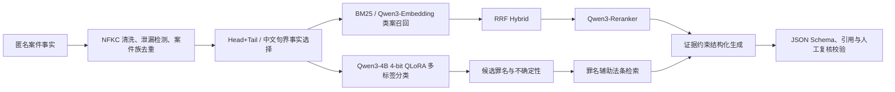

# LegalMind-RAG：证据与法条约束的刑事案件智能分析系统

输入匿名化刑事案件事实，系统完成多标签罪名预测、法条与类案检索、候选重排、结构化分析、引用校验和不确定性控制。项目重点是可追溯的数据与实验链路，不提供法律意见。

## 为什么做这件事

普通罪名分类器只能给标签。真实案件还存在长文本截断、长尾罪名、相似罪名混淆和多罪名共现；直接使用生成模型又容易输出错误法条、编造案例或忽略证据不足。LegalMind-RAG 将分类、检索和生成拆成可独立评测的模块，并在最终输出前验证所有案例与法条引用。



## 当前真实完成状态

| 模块 | 状态 | 实际结果 |
|---|---|---|
| 仓库、环境、数据审计 | 完成 | 4 份审计报告；原文件只读 |
| processed_v2 数据 | 完成 | 120,393 / 15,032 / 15,097；202 标签 |
| 数据隔离 | 完成 | 精确、规范化文本和案件族跨集合重叠均为 0 |
| Majority Baseline | 完成 | 验证集 Micro-F1 0.0572 |
| char TF-IDF + Linear | 完成 | 验证集 Micro-F1 0.8092 |
| 历史 10K QLoRA | 保留 | 验证 0.8332，独立测试 0.8296 Micro-F1 |
| v2 QLoRA Smoke | 完成 | 1,000/100，Micro-F1 0.0073，仅验证链路 |
| v2 Full QLoRA | `running_resumed` | 已核验 `checkpoint-500` 并从第 501 步安全续训；最终指标待完成 |
| 法条库 | 完成 | 官方政府页面自动下载并解析为 452 个唯一条号，未人工逐条审核 |
| 案例库 | 完成 | 仅训练集 120,393 案、128,107 Chunk |
| 全库 BM25 Pilot | 完成 | 200 查询，代理 MRR@10 0.4654、nDCG@10 0.2846 |
| Qwen3 Dense/Reranker Pilot | 完成 | 5,000 Chunk、100 查询；见下表 |
| 检索审核集 | 完成 | 200 查询、1,139 候选、1,152 条 silver qrels；人工审核 0 |
| Reranker 难负样本 | 完成 | train-only 14,536 三元组、4,882 个查询，全部 `unreviewed` |
| 生成 SFT v3.1 数据 | 完成 | train 4,500 / validation 550，含 500/50 条信息不足样本 |
| 生成 SFT Smoke | 完成 | 100/20；训练 46.6 秒，峰值 9.46 GiB |
| DPO/GRPO | 不实施 | 前置质量门槛未满足 |
| 测试与静态检查 | 完成 | 53 passed；Ruff check/format 通过 |

所有 Full、Smoke、Pilot 和历史实验在文档中明确区分。仓库没有把计划值写成实验结果。

## 环境激活

所有命令都应在项目 Conda 环境中运行。SSH 登录后先执行：

```bash
cd /root/autodl-tmp/LegalMind-RAG
source /root/miniconda3/etc/profile.d/conda.sh
conda activate /root/autodl-tmp/conda/envs/legalmind
export PYTHONPATH=src
export OMP_NUM_THREADS=8
```

未激活环境时，系统 Python 可能缺少 `pydantic`、PyTorch 或 PEFT。下文保留完整环境变量前缀，使单条命令也便于复制。

## 数据与许可状态

当前服务器上的主分类文件 `data/train_data.jsonl` 是 CAIL2018 的历史派生文件，共 154,592 条，SHA256 为 `5d287aed962c8387f751c0fdd0599ea105469dfb0a0f80a89ce239373853e404`。它保留罪名和量刑信息，但已经丢失原始 `relevant_articles`。其本机来源状态记录为 `legacy_local_file_unverified`，对外发布前必须用 CAIL 官方原始文件复现并补充许可证据。

`data/local_legacy/rest_data.jsonl` 有 748,203 条，但来源、分布和与训练集重叠尚不足以证明适合训练，因此没有并入 v2。独立旧测试文件只有 300 条且与训练源存在重叠，也没有直接作为 v2 最终测试集。

数据流水线执行：Unicode NFKC、控制字符与空白清理、低信息文本过滤、显式目标语句遮蔽、精确/规范化/近重复检测和案件族分组切分。标签映射只由训练集建立。processed_v2 实际数量：

- train：120,393
- validation：15,032
- test：15,097
- 标签：202
- 多集合精确、规范化文本与 dedup group 重叠：0
- 显式罪名结论被遮蔽：train 58,189；validation 7,247；test 7,220
- 自动生成和旧数据均未宣称人工金标

处理后哈希与全部统计位于 `data/processed_v2/dataset_manifest.json`、`data/processed_v2/file_hashes.json` 和 `reports/data/`。

法条文本来自国家统计局公开的《中华人民共和国刑法》页面：<https://www.stats.gov.cn/gk/tjfg/xgfxfg/202503/t20250311_1958931.html>。下载时间、原始 HTML/文本 SHA256、页面说明和解析状态记录在 `data/raw/statutes/manifest.json`。页面标注包含刑法修正案（十二），项目仍将自动解析结果标为 `unreviewed`；实际法律使用前必须核验时效和正文。

## 分类与 QLoRA

任务保留一案多罪，使用 multi-hot 标签与 `BCEWithLogitsLoss`。正式分类主指标统一为 Micro-F1；本项目中存在多标签样本，因此它不等同于简单 Accuracy。

QLoRA 配置：Qwen3-4B、4-bit NF4、double quant、BF16、LoRA `r=16/alpha=32/dropout=0.05`、`all-linear`、gradient checkpointing、动态 Padding、`pad_to_multiple_of=8` 和长度分桶。LoRA 训练低秩增量，4-bit 基座保持冻结，Adapter 独立保存。

4090D 同一 2,048 token 压力条件下的实际 Batch Benchmark：

| micro batch | accumulation | 有效 batch | 峰值 allocated | 结果 |
|---:|---:|---:|---:|---|
| 2 | 16 | 32 | 9.30 GiB | 完成 |
| 4 | 8 | 32 | 15.24 GiB | 完成，当前选择 |
| 8 | 4 | 32 | 21.72 GiB | OOM |

2,000 条样本的 Padding 审计：固定 2,048 长度 Padding Ratio 0.8346；随机动态 Padding 0.4671；动态 Padding + 长度分桶 0.0139。不同样本不会通过“拼接”看到彼此 token。

```bash
OMP_NUM_THREADS=8 PYTHONPATH=src python -m legalmind.data.build_dataset \
  --config configs/data/processed_v2.yaml

OMP_NUM_THREADS=8 PYTHONPATH=src python -m legalmind.baselines \
  --data-dir data/processed_v2 \
  --output-dir artifacts/experiments/baselines_v2

# v2 Smoke
OMP_NUM_THREADS=8 PYTHONPATH=src python scripts/train_qlora.py \
  --training-config configs/classification/qwen3_4b_qlora_smoke.yaml

# v2 Full，输出目录独立
OMP_NUM_THREADS=8 PYTHONPATH=src python scripts/train_qlora.py \
  --training-config configs/classification/qwen3_4b_qlora_full.yaml

# 中断后自动从最新 checkpoint 恢复
OMP_NUM_THREADS=8 PYTHONPATH=src python scripts/train_qlora.py \
  --training-config configs/classification/qwen3_4b_qlora_full.yaml \
  --resume-from-checkpoint
```

训练支持自动发现最新 Checkpoint、断点续训、独立实验目录、数据哈希、环境版本、耗时、吞吐量、Padding Ratio、峰值显存与验证 Micro-F1。测试集不用于阈值或超参数选择。

## 长文本处理

先用 Qwen3 tokenizer 统计长度，再选择 2,048 token 训练上限。代码实现前截断、Head+Tail 和中文句界事实片段选择。句界策略只使用输入事实中的行为主体、方式、工具、金额、伤情、结果、主观意图、自首、累犯、赔偿和谅解线索，不读取测试标签。三种策略的 Full Micro-F1 消融仍为 `not_run`。

## 检索、难负样本与 Reranker

案例 Chunk 按句界切分为 1,024 token、128 token overlap，保留 `case_id/chunk_id/source_split/accusation/text_sha256`。测试与验证案例不会进入知识库。

全库稀疏 BM25 的 200 查询实验使用“共享罪名”自动代理相关性：MRR@10 0.4654、nDCG@10 0.2846、HitRate@10 0.765。Recall@10 只有 0.0007，因为同罪名相关集合非常大；该定义更适合快速回归，不等价于人工类案相关性。

同一 5,000-Chunk、100-query Pilot 的结果：

| 方法 | Recall@10 | MRR@10 | nDCG@10 | HitRate@10 |
|---|---:|---:|---:|---:|
| BM25 | 0.0061 | 0.8520 | 0.7848 | 1.0000 |
| Qwen3 Dense | 0.0076 | 1.0000 | 0.9863 | 1.0000 |
| RRF Hybrid | 0.0069 | 0.9700 | 0.9013 | 1.0000 |
| Hybrid + 预训练 Reranker | 0.0072 | 0.9800 | 0.9467 | 1.0000 |

Reranker 改善了 Hybrid，但未超过 Dense。Qrels 没有人工审核，当前不能声称真实法律相关性提升。新评测集从 validation 选择 200 条查询，候选只来自 train；生成 1,152 条 `silver_proxy/unreviewed` qrels 和可人工填写的 CSV，`reviewed_qrels.jsonl` 当前为空。

train-only 难负样本挖掘从 5,000 个查询中生成 14,536 个三元组，覆盖同罪名不同行为、金额、结果、主观意图、共同犯罪和既遂/未遂等 8 类。领域 Reranker Pilot 已实现，正式训练与同评测集对比要等待 Full 分类训练释放 GPU。

```bash
OMP_NUM_THREADS=8 PYTHONPATH=src python scripts/build_knowledge.py
OMP_NUM_THREADS=8 PYTHONPATH=src python scripts/build_bm25_experiment.py \
  --output-dir artifacts/experiments/bm25_sparse64_eval_v2 --max-queries 200
HF_ENDPOINT=https://hf-mirror.com OMP_NUM_THREADS=8 PYTHONPATH=src \
  python scripts/run_dense_reranker_experiment.py \
  --config configs/retrieval/qwen3_pilot.yaml

OMP_NUM_THREADS=4 PYTHONPATH=src python scripts/build_reranker_data.py \
  --queries 5000 --negatives-per-query 3 --seed 42

PYTHONPATH=src python scripts/build_retrieval_eval.py --queries 200 --seed 42
```

## 结构化生成与 SFT

生成输出字段固定为：`predicted_accusations`、`relevant_articles`、`key_facts`、`missing_information`、`similar_cases`、`analysis`、`confidence` 和 `requires_manual_review`。案例与法条引用必须来自本次检索上下文。

SFT v3.1 使用第一版简化 Schema：`candidate_accusations/key_facts/confidence/requires_manual_review`。训练数据 4,500 条，validation 550 条；其中 500/50 条把训练或验证案件确定性裁剪为信息不足输入，目标为空罪名、低置信度并触发人工复核。所有目标通过 Pydantic Schema，train/validation 来源案件重叠为 0，test 使用数为 0，全部保持 `unreviewed`。

旧评测把字段名不匹配也计入 JSON 失败。逐条复核同一 20 条 Smoke 后，Prompt Baseline 原始 JSON 可解析率为 1.00，100 条 SFT Adapter 为 0.95；两者旧 Full Schema 通过率仍为 0。主要问题是中文字段名、中文置信度、罪名后缀和 1 条输出截断。确定性规范化修复后，简化 Schema 通过率分别为 1.00/0.95，罪名字段 Micro-F1 为 0.9091/0.9048。这只是 20 条 Smoke 诊断，不能作为正式生成结果。v3.1 Pilot 尚未训练。

```bash
PYTHONPATH=src python scripts/build_simple_sft.py --output-dir data/sft_v3_1
PYTHONPATH=src python scripts/validate_interview_datasets.py
PYTHONPATH=src python -m legalmind.training.train_generator \
  --config configs/generation/qwen3_4b_sft_v3_pilot.yaml
```

## 不确定性与降级

- 分类没有标签超过验证阈值时，状态为 `uncertain_below_threshold`，记录 `used_fallback` 和最大概率；
- Fallback 候选只取前三个进入分析，并强制 `requires_manual_review=true`；
- 法条检索优先用候选罪名召回定义性条款，再补最多一条事实情节条款；
- 没有分类器、索引、Reranker 或生成模型时，统一入口显式返回降级状态；
- 最终 JSON 逐项校验案例 ID 和法条是否存在于检索结果。

```bash
OMP_NUM_THREADS=8 python -m src.legalmind.pipeline.analyze_case \
  --fact-file examples/case.txt \
  --config configs/pipeline/default.yaml
```

实际 Demo 的模型加载后阶段耗时约 0.85 秒；示例触发了 `uncertain_below_threshold`、引用校验通过并要求人工复核。该单条时间不代表服务压测吞吐量。

## 为什么暂不做 DPO / GRPO

生成 SFT 尚未稳定，法条标签缺失，检索 qrels 未经人工审核，也没有真实 chosen/rejected 偏好对。当前瓶颈优先通过恢复原始 CAIL 字段、人工检索标注、SFT 数据审核和普通 SFT 解决。决策记录见 `reports/alignment/rl_decision.md`。满足门槛后优先小规模 DPO，不直接加入 GRPO。

## 测试、审计和实验

```bash
OMP_NUM_THREADS=8 PYTHONPATH=src pytest -q
ruff check .
ruff format --check .
OMP_NUM_THREADS=8 PYTHONPATH=src python -m legalmind.data.validate \
  --data-dir data/processed_v2
OMP_NUM_THREADS=8 PYTHONPATH=src python scripts/build_experiment_index.py
```

每个新实验使用 `artifacts/experiments/<name>/`，保存配置、数据哈希、Manifest、指标、预测、日志和 Checkpoint。历史结果不覆盖。本阶段备份位于 `/root/autodl-tmp/backups/legalmind_interview_ready_20260820T205654Z/`。

## 已知局限

- 当前 CAIL 派生文件的下载来源和许可尚未在服务器上恢复，且缺少法条字段；
- 自动罪名泄漏遮蔽命中比例较高，需要法律专业人员抽样审核；
- 202 类具有明显长尾，Micro-F1 会被高频类别主导；
- 检索指标使用共享罪名代理 qrels，人工相关性评测待完成；
- 领域难负样本已经构造，Reranker 微调与同评测集对比尚未运行；
- v2 Full 分类正在从 checkpoint-500 续训，长文本消融和 SFT v3.1 Pilot 尚未运行；
- 法条页面与自动解析结果未经过专业人员逐条核验；
- 项目输出只用于算法实验，不能作为案件判断、量刑建议或其他法律意见。

## 面试材料

20–30 分钟项目讲解、深挖问题与中英文简历版本位于 `docs/interview/`。回答只引用当前代码和实际实验；待测内容均保持 `not_run` 或 `pending_manual_review`。
