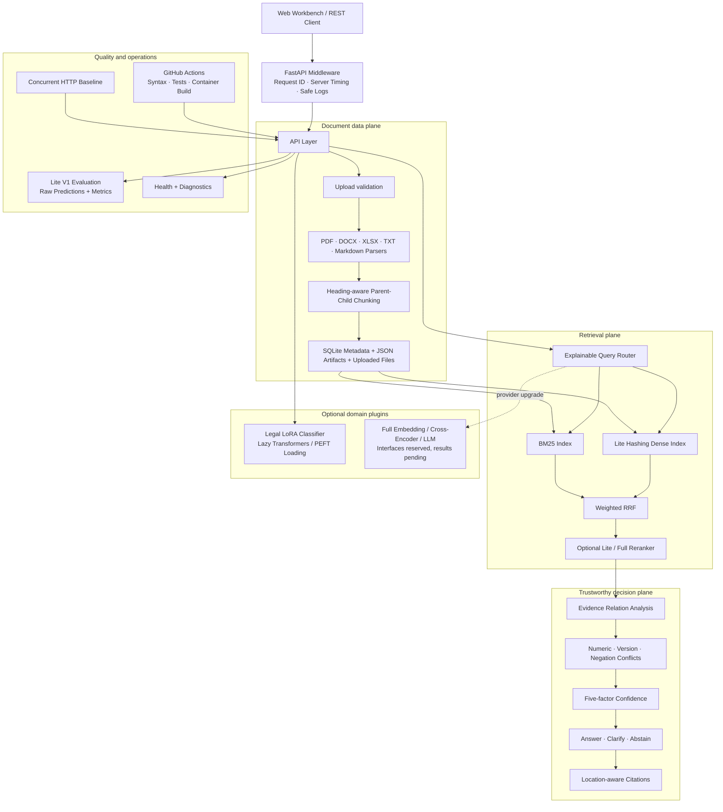

# DocMind-RAG architecture

## System view

## Design decisions

### Keep Lite mode independently runnable

The default path requires no API key, GPU, FAISS, Transformers or OCR. Optional model
providers are delayed until their endpoint is used. This keeps development, CI and the
interview demo reproducible on a CPU machine.

### Preserve document location and hierarchy

Parsed elements retain page, section, content type and format-specific metadata. Parent
chunks preserve context while child chunks are retrieved. Child text is prefixed with
its section so that headings and entities are not lost during retrieval.

### Route before fusion

The rule-first Query Router returns an inspectable plan. Exact identifiers favor BM25;
semantic or comparison questions increase the dense channel; table-like questions use
both exact and contextual signals. Standard weighted RRF only rewards channels where a
candidate actually appears.

### Treat uncertainty as a product decision

Confidence is calculated from evidence relevance, channel agreement, ranking margin,
citation coverage and conflict penalty. It is not an LLM self-reported probability.
Conflicting evidence produces `clarify`; missing evidence produces `abstain`.

### Separate immutable benchmark data from runtime state

The repository contains only the authored Lite corpus and labels. Uploads, SQLite,
indexes, logs, model weights and evaluation artifacts are ignored. The container stores
runtime state in `/var/lib/docmind`, separate from `/app/data/eval`.

## Current boundaries

- Lite Dense is deterministic feature hashing, not a semantic embedding model.
- Lite reranking is a transparent lexical baseline, not a trained Cross-Encoder.
- Conflict analysis is rule-based and is not a trained NLI model.
- The 7-document, 14-question benchmark is a regression suite, not production evidence.
- Legal model assets were structurally validated; full inference quality is still pending.
